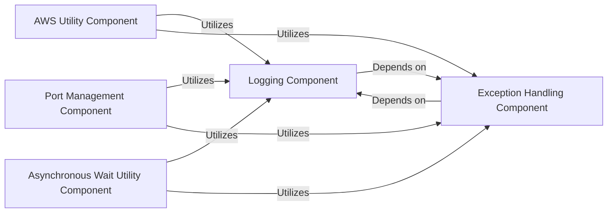

## Details

The Core Utilities subsystem in SWE-ReX is a foundational collection of modules that provide essential, cross-cutting functionalities. These utilities are designed to support various aspects of the project, including deployment, runtime management, and general system operations. The components within this subsystem are fundamental because they encapsulate common patterns and interactions, promoting code reusability, maintainability, and robustness across the entire SWE-ReX application.

### AWS Utility Component

This component provides a set of functions to interact with Amazon Web Services (AWS), specifically for managing Fargate deployments. It abstracts away the complexities of AWS API calls for tasks such as retrieving cluster ARNs, execution role ARNs, task definitions, running Fargate tasks, and obtaining public IPs of running tasks.

**Related Classes/Methods**:

- <a href="https://github.com/synth-laboratories/SWE-ReX/src/swerex/utils/aws.py#L1-L1" target="_blank" rel="noopener noreferrer">`swerex/utils/aws.py` (1:1)</a>

### Port Management Component

This component offers a utility function to find an available network port on the local system. This is essential for applications that need to bind to a dynamic port to avoid conflicts, especially in local development or testing environments where multiple services might be running.

**Related Classes/Methods**:

- <a href="https://github.com/synth-laboratories/SWE-ReX/src/swerex/utils/free_port.py#L1-L1" target="_blank" rel="noopener noreferrer">`swerex/utils/free_port.py` (1:1)</a>

### Asynchronous Wait Utility Component

This component provides generic waiting mechanisms for asynchronous operations. Specifically, it includes functionalities like `_wait_until_alive` which is used to pause execution until a certain condition (e.g., a service becoming responsive) is met. This is vital for coordinating interdependent processes and ensuring proper sequencing of operations.

**Related Classes/Methods**:

- <a href="https://github.com/synth-laboratories/SWE-ReX/src/swerex/utils/wait.py#L1-L1" target="_blank" rel="noopener noreferrer">`swerex/utils/wait.py` (1:1)</a>

### Logging Component

This component provides a centralized and consistent logging mechanism for the entire `SWE-ReX` system. It allows for recording events, debugging information, warnings, and errors, which is crucial for monitoring, debugging, and auditing the system's behavior.

**Related Classes/Methods**:

- <a href="https://github.com/synth-laboratories/SWE-ReX/src/swerex/utils/log.py#L1-L1" target="_blank" rel="noopener noreferrer">`swerex/utils/log.py` (1:1)</a>

### Exception Handling Component

This component defines a hierarchy of custom exceptions used throughout the `SWE-ReX` system. These custom exceptions provide a structured and specific way to signal various error conditions, improving error handling, debugging, and the overall robustness of the application.

**Related Classes/Methods**:

- <a href="https://github.com/synth-laboratories/SWE-ReX/src/swerex/exceptions.py#L1-L1" target="_blank" rel="noopener noreferrer">`swerex/exceptions.py` (1:1)</a>

### [FAQ](https://github.com/CodeBoarding/GeneratedOnBoardings/tree/main?tab=readme-ov-file#faq)