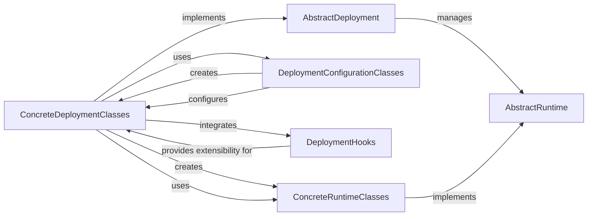

## Details

The `Deployment Orchestration` subsystem is crucial for managing the lifecycle of SWE-ReX environments across diverse platforms. It provides a unified interface for starting, stopping, and monitoring deployments, while also offering extensibility through a robust hooking mechanism.

### AbstractDeployment

The foundational abstract class for all deployment types. It defines the common interface and lifecycle methods (`start`, `stop`, `is_alive`, `add_hook`) that any SWE-ReX environment deployment must adhere to, ensuring a consistent management contract.

**Related Classes/Methods**:

- <a href="https://github.com/synth-laboratories/SWE-ReX/src/swerex/deployment/abstract.py#L10-L55" target="_blank" rel="noopener noreferrer">`swerex.deployment.abstract.AbstractDeployment` (10:55)</a>

### ConcreteDeploymentClasses

A group of concrete classes (`LocalDeployment`, `DockerDeployment`, `FargateDeployment`, `ModalDeployment`, `RemoteDeployment`, `DummyDeployment`) that extend `AbstractDeployment`. Each class encapsulates the platform-specific logic required to set up, manage, and tear down the SWE-ReX environment on its respective platform. They are the active agents in initiating and controlling the deployed environment.

**Related Classes/Methods**:

- <a href="https://github.com/synth-laboratories/SWE-ReX/src/swerex/deployment/local.py#L16-L72" target="_blank" rel="noopener noreferrer">`swerex.deployment.local.LocalDeployment` (16:72)</a>

- <a href="https://github.com/synth-laboratories/SWE-ReX/src/swerex/deployment/docker.py#L40-L217" target="_blank" rel="noopener noreferrer">`swerex.deployment.docker.DockerDeployment` (40:217)</a>

- <a href="https://github.com/synth-laboratories/SWE-ReX/src/swerex/deployment/fargate.py#L30-L184" target="_blank" rel="noopener noreferrer">`swerex.deployment.fargate.FargateDeployment` (30:184)</a>

- <a href="https://github.com/synth-laboratories/SWE-ReX/src/swerex/deployment/modal.py#L110-L282" target="_blank" rel="noopener noreferrer">`swerex.deployment.modal.ModalDeployment` (110:282)</a>

- <a href="https://github.com/synth-laboratories/SWE-ReX/src/swerex/deployment/remote.py#L14-L72" target="_blank" rel="noopener noreferrer">`swerex.deployment.remote.RemoteDeployment` (14:72)</a>

- <a href="https://github.com/synth-laboratories/SWE-ReX/src/swerex/deployment/dummy.py#L13-L48" target="_blank" rel="noopener noreferrer">`swerex.deployment.dummy.DummyDeployment` (13:48)</a>

### DeploymentConfigurationClasses

A collection of data classes (`LocalDeploymentConfig`, `DockerDeploymentConfig`, `FargateDeploymentConfig`, `ModalDeploymentConfig`, `RemoteDeploymentConfig`, `DummyDeploymentConfig`) designed to hold all necessary parameters and settings for a specific deployment type. These classes act as factories, providing methods (e.g., `get_deployment()`) to instantiate the corresponding `ConcreteDeploymentClasses`, thereby effectively decoupling deployment logic from its configuration details.

**Related Classes/Methods**:

- <a href="https://github.com/synth-laboratories/SWE-ReX/src/swerex/deployment/config.py#L8-L19" target="_blank" rel="noopener noreferrer">`swerex.deployment.config.LocalDeploymentConfig` (8:19)</a>

- <a href="https://github.com/synth-laboratories/SWE-ReX/src/swerex/deployment/config.py#L22-L46" target="_blank" rel="noopener noreferrer">`swerex.deployment.config.DockerDeploymentConfig` (22:46)</a>

- <a href="https://github.com/synth-laboratories/SWE-ReX/src/swerex/deployment/config.py#L49-L86" target="_blank" rel="noopener noreferrer">`swerex.deployment.config.ModalDeploymentConfig` (49:86)</a>

- <a href="https://github.com/synth-laboratories/SWE-ReX/src/swerex/deployment/config.py#L89-L111" target="_blank" rel="noopener noreferrer">`swerex.deployment.config.FargateDeploymentConfig` (89:111)</a>

- <a href="https://github.com/synth-laboratories/SWE-ReX/src/swerex/deployment/config.py#L114-L135" target="_blank" rel="noopener noreferrer">`swerex.deployment.config.RemoteDeploymentConfig` (114:135)</a>

- <a href="https://github.com/synth-laboratories/SWE-ReX/src/swerex/deployment/config.py#L138-L149" target="_blank" rel="noopener noreferrer">`swerex.deployment.config.DummyDeploymentConfig` (138:149)</a>

### DeploymentHooks

This component provides a flexible mechanism to inject custom logic at various stages of the deployment lifecycle. `DeploymentHook` (Abstract): The base interface that all custom deployment hooks must implement. `CombinedDeploymentHook`: A concrete implementation that acts as a composite, holding and executing multiple `DeploymentHook` instances sequentially. `SetStatusDeploymentHook` (Example): A specific concrete hook used to update the status of a deployment.

**Related Classes/Methods**:

- <a href="https://github.com/synth-laboratories/SWE-ReX/src/swerex/deployment/hooks/abstract.py#L0-L0" target="_blank" rel="noopener noreferrer">`swerex.deployment.hooks.abstract.CombinedDeploymentHook` (0:0)</a>

- <a href="https://github.com/synth-laboratories/SWE-ReX/src/swerex/deployment/hooks/abstract.py#L0-L0" target="_blank" rel="noopener noreferrer">`swerex.deployment.hooks.abstract.DeploymentHook` (0:0)</a>

- <a href="https://github.com/synth-laboratories/SWE-ReX/src/swerex/deployment/hooks/status.py#L5-L14" target="_blank" rel="noopener noreferrer">`swerex.deployment.hooks.status.SetStatusDeploymentHook` (5:14)</a>

### AbstractRuntime

The abstract base class for all runtime environments. It defines the common interface for interacting with a deployed SWE-ReX instance, such as executing commands or checking the operational status. It represents the operational interface available *after* a successful deployment.

**Related Classes/Methods**:

- <a href="https://github.com/synth-laboratories/SWE-ReX/src/swerex/runtime/abstract.py#L220-L274" target="_blank" rel="noopener noreferrer">`swerex.runtime.abstract.AbstractRuntime` (220:274)</a>

### ConcreteRuntimeClasses

A group of concrete classes (`LocalRuntime`, `RemoteRuntime`, `DummyRuntime`) that implement the `AbstractRuntime` interface. They provide the actual mechanisms for communication and interaction with the deployed SWE-ReX instances, tailored to the specific environment (e.g., local shell execution, remote API calls).

**Related Classes/Methods**:

- <a href="https://github.com/synth-laboratories/SWE-ReX/src/swerex/runtime/local.py#L361-L472" target="_blank" rel="noopener noreferrer">`swerex.runtime.local.LocalRuntime` (361:472)</a>

- <a href="https://github.com/synth-laboratories/SWE-ReX/src/swerex/runtime/remote.py#L40-L215" target="_blank" rel="noopener noreferrer">`swerex.runtime.remote.RemoteRuntime` (40:215)</a>

- <a href="https://github.com/synth-laboratories/SWE-ReX/src/swerex/runtime/dummy.py#L32-L93" target="_blank" rel="noopener noreferrer">`swerex.runtime.dummy.DummyRuntime` (32:93)</a>

### [FAQ](https://github.com/CodeBoarding/GeneratedOnBoardings/tree/main?tab=readme-ov-file#faq)