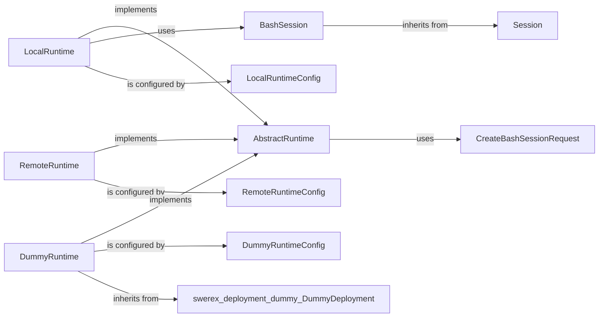

## Details

The `Runtime Management` subsystem is crucial for abstracting execution environments, allowing SWE-ReX to interact with local, remote, or simulated systems seamlessly. The core of this subsystem revolves around the `AbstractRuntime` and its concrete implementations, along with session management and configuration.

### AbstractRuntime

This is the foundational abstract class that defines the common interface for all runtime environments. It establishes the contract for executing commands, managing files, and handling sessions, ensuring a consistent API regardless of the underlying execution context.

**Related Classes/Methods**:

- `AbstractRuntime` (1:1)

### LocalRuntime

A concrete implementation of `AbstractRuntime` tailored for executing commands and managing files directly on the local machine. It leverages `BashSession` for interactive shell operations.

**Related Classes/Methods**:

- `LocalRuntime` (1:1)

### RemoteRuntime

Another concrete implementation of `AbstractRuntime`, designed for interacting with remote execution environments. This could involve SSH, Docker, Fargate, or other cloud-based platforms, abstracting the complexities of remote communication.

**Related Classes/Methods**:

- `RemoteRuntime` (1:1)

### DummyRuntime

An implementation of `AbstractRuntime` that simulates command execution without performing actual system calls. It's primarily used for testing, debugging, and rapid prototyping by providing predefined outputs.

**Related Classes/Methods**:

- `DummyRuntime` (1:1)

### BashSession

Manages an interactive bash shell session, primarily used by `LocalRuntime`. It handles sending commands to the shell and capturing its output, including standard output, standard error, and exit codes.

**Related Classes/Methods**:

- `BashSession` (1:1)

### Session

An abstract base class that defines the common interface for all session types. `BashSession` inherits from this class, ensuring a consistent approach to session management.

**Related Classes/Methods**:

- `Session` (1:1)

### LocalRuntimeConfig

A data structure that encapsulates configuration parameters specific to the `LocalRuntime`, such as working directories or environment variables.

**Related Classes/Methods**:

- `LocalRuntimeConfig` (1:1)

### RemoteRuntimeConfig

Defines configuration parameters specific to the `RemoteRuntime`, including details like host addresses, credentials, or container images.

**Related Classes/Methods**:

- `RemoteRuntimeConfig` (1:1)

### DummyRuntimeConfig

Defines configuration parameters for the `DummyRuntime`, such as predefined outputs for specific commands or error simulations.

**Related Classes/Methods**:

- `DummyRuntimeConfig` (1:1)

### CreateBashSessionRequest

A data structure used to encapsulate parameters required for creating a new bash session, such as the initial working directory or environment variables.

**Related Classes/Methods**:

- `CreateBashSessionRequest` (1:1)

### [FAQ](https://github.com/CodeBoarding/GeneratedOnBoardings/tree/main?tab=readme-ov-file#faq)