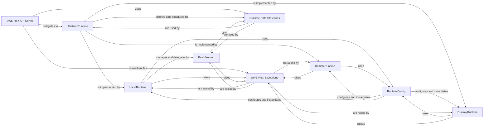

## Details

The SWE-ReX API Server subsystem is a critical part of the SWE-ReX project, acting as the primary interface for external interactions. Its core responsibility is to manage client requests, orchestrate session lifecycles, and delegate operations to the appropriate runtime environments. This analysis details the central components within this subsystem, their responsibilities, and their interactions, ensuring a clear separation of concerns, modularity, testability, and extensibility within the SWE-ReX system.

### SWE-ReX API Server [[Expand]](./SWE_ReX_API_Server.md)

The public-facing entry point of the SWE-ReX system. It exposes a set of API endpoints for session management (create, close), command execution, and file operations (read, write, upload). It acts as a facade, abstracting the underlying runtime complexities from external consumers and routing requests to the appropriate AbstractRuntime implementation.

**Related Classes/Methods**:

- `SWE-ReX API Server` (1:1)

### AbstractRuntime

Defines the common interface and contract for all concrete runtime environments within SWE-ReX. It specifies methods for session creation, command execution, file operations, and session termination, ensuring polymorphic behavior across different runtime implementations.

**Related Classes/Methods**:

- `AbstractRuntime` (1:1)

### LocalRuntime

A concrete implementation of AbstractRuntime that manages command execution and file operations within the local environment where the SWE-ReX server is running. It leverages BashSession for interactive shell interactions.

**Related Classes/Methods**:

- `LocalRuntime` (1:1)

### RemoteRuntime

A concrete implementation of AbstractRuntime designed to handle interactions with a remote execution environment. It abstracts network communication, remote command execution, and file transfers, enabling SWE-ReX to operate against remote machines or cloud instances.

**Related Classes/Methods**:

- `RemoteRuntime` (1:1)

### DummyRuntime

A concrete implementation of AbstractRuntime providing a mock runtime environment. It simulates command execution and file operations for testing, development, and demonstration purposes, often using predefined outputs or simple logic.

**Related Classes/Methods**:

- `DummyRuntime` (1:1)

### BashSession

A core component primarily used by LocalRuntime responsible for managing a single Bash shell session. It handles starting, running commands, interrupting, and closing the session, including parsing output and handling control characters.

**Related Classes/Methods**:

- `BashSession` (1:1)

### RuntimeConfig

A set of data classes responsible for holding configuration parameters specific to each runtime type (Local, Remote, Dummy). These configurations are used by the respective Runtime classes during their initialization to set up the environment correctly.

**Related Classes/Methods**:

- `RuntimeConfig` (1:1)

### SWE-ReX Exceptions

A dedicated module containing custom exception classes used throughout the SWE-ReX system. These exceptions signal specific error conditions (e.g., SessionDoesNotExistError, CommandTimeoutError, NonZeroExitCodeError), providing structured and domain-specific error handling.

**Related Classes/Methods**:

- `SWE-ReX Exceptions` (1:1)

### Runtime Data Structures

This component defines various Data Transfer Objects (DTOs) used for standardizing the input and output of runtime operations. These DTOs ensure clear and consistent data exchange between the SWE-ReX API Server and the AbstractRuntime implementations.

**Related Classes/Methods**:

- `Runtime Data Structures` (1:1)

### [FAQ](https://github.com/CodeBoarding/GeneratedOnBoardings/tree/main?tab=readme-ov-file#faq)