```mermaid

graph LR

    SWE_ReX_API_Server["SWE-ReX API Server"]

    Runtime_Management["Runtime Management"]

    Deployment_Orchestration["Deployment Orchestration"]

    Core_Utilities["Core Utilities"]

    SWE_ReX_API_Server -- "Delegates requests to" --> Runtime_Management

    Runtime_Management -- "Processes requests from" --> SWE_ReX_API_Server

    Runtime_Management -- "Managed by" --> Deployment_Orchestration

    Deployment_Orchestration -- "Manages instances of" --> Runtime_Management

    Deployment_Orchestration -- "Utilizes" --> Core_Utilities

    Core_Utilities -- "Provides services to" --> Deployment_Orchestration

    click SWE_ReX_API_Server href "https://github.com/SWE-agent/SWE-ReX/blob/main/.codeboarding//SWE_ReX_API_Server.md" "Details"

    click Runtime_Management href "https://github.com/SWE-agent/SWE-ReX/blob/main/.codeboarding//Runtime_Management.md" "Details"

    click Deployment_Orchestration href "https://github.com/SWE-agent/SWE-ReX/blob/main/.codeboarding//Deployment_Orchestration.md" "Details"

    click Core_Utilities href "https://github.com/SWE-agent/SWE-ReX/blob/main/.codeboarding//Core_Utilities.md" "Details"

```

## Details

Final Architecture Analysis for SWE-ReX

### SWE-ReX API Server [[Expand]](./SWE_ReX_API_Server.md)

Provides the external interface for SWE-ReX, handling client requests for session management, command execution, and file operations. It acts as the primary entry point for user interactions.

**Related Classes/Methods**:

- <a href="https://github.com/synth-laboratories/SWE-ReX/src/swerex/server.py#L72-L73" target="_blank" rel="noopener noreferrer">`src.swerex.server.is_alive` (72:73)</a>

- <a href="https://github.com/synth-laboratories/SWE-ReX/src/swerex/server.py#L77-L78" target="_blank" rel="noopener noreferrer">`src.swerex.server.create_session` (77:78)</a>

- <a href="https://github.com/synth-laboratories/SWE-ReX/src/swerex/server.py#L82-L83" target="_blank" rel="noopener noreferrer">`src.swerex.server.run` (82:83)</a>

- <a href="https://github.com/synth-laboratories/SWE-ReX/src/swerex/server.py#L87-L88" target="_blank" rel="noopener noreferrer">`src.swerex.server.close_session` (87:88)</a>

- <a href="https://github.com/synth-laboratories/SWE-ReX/src/swerex/server.py#L92-L93" target="_blank" rel="noopener noreferrer">`src.swerex.server.execute` (92:93)</a>

- <a href="https://github.com/synth-laboratories/SWE-ReX/src/swerex/server.py#L97-L98" target="_blank" rel="noopener noreferrer">`src.swerex.server.read_file` (97:98)</a>

- <a href="https://github.com/synth-laboratories/SWE-ReX/src/swerex/server.py#L102-L103" target="_blank" rel="noopener noreferrer">`src.swerex.server.write_file` (102:103)</a>

- <a href="https://github.com/synth-laboratories/SWE-ReX/src/swerex/server.py#L107-L128" target="_blank" rel="noopener noreferrer">`src.swerex.server.upload` (107:128)</a>

- <a href="https://github.com/synth-laboratories/SWE-ReX/src/swerex/server.py#L132-L134" target="_blank" rel="noopener noreferrer">`src.swerex.server.close` (132:134)</a>

### Runtime Management [[Expand]](./Runtime_Management.md)

Defines and implements the core logic for interacting with various execution environments (local, remote, dummy). It manages sessions, executes commands, and handles file operations within these environments, abstracting the underlying execution details. This component also encompasses the configuration for these runtimes and manages individual bash sessions.

**Related Classes/Methods**:

- <a href="https://github.com/synth-laboratories/SWE-ReX/src/swerex/runtime/abstract.py#L220-L274" target="_blank" rel="noopener noreferrer">`swerex.runtime.abstract.AbstractRuntime` (220:274)</a>

- <a href="https://github.com/synth-laboratories/SWE-ReX/src/swerex/runtime/local.py#L361-L472" target="_blank" rel="noopener noreferrer">`swerex.runtime.local.LocalRuntime` (361:472)</a>

- <a href="https://github.com/synth-laboratories/SWE-ReX/src/swerex/runtime/remote.py#L40-L215" target="_blank" rel="noopener noreferrer">`swerex.runtime.remote.RemoteRuntime` (40:215)</a>

- <a href="https://github.com/synth-laboratories/SWE-ReX/src/swerex/runtime/dummy.py#L32-L93" target="_blank" rel="noopener noreferrer">`swerex.runtime.dummy.DummyRuntime` (32:93)</a>

- <a href="https://github.com/synth-laboratories/SWE-ReX/src/swerex/runtime/config.py#L7-L18" target="_blank" rel="noopener noreferrer">`swerex.runtime.config.LocalRuntimeConfig` (7:18)</a>

- <a href="https://github.com/synth-laboratories/SWE-ReX/src/swerex/runtime/config.py#L21-L39" target="_blank" rel="noopener noreferrer">`swerex.runtime.config.RemoteRuntimeConfig` (21:39)</a>

- <a href="https://github.com/synth-laboratories/SWE-ReX/src/swerex/runtime/config.py#L42-L53" target="_blank" rel="noopener noreferrer">`swerex.runtime.config.DummyRuntimeConfig` (42:53)</a>

- <a href="https://github.com/synth-laboratories/SWE-ReX/src/swerex/runtime/local.py#L126-L358" target="_blank" rel="noopener noreferrer">`swerex.runtime.local.BashSession` (126:358)</a>

- <a href="https://github.com/synth-laboratories/SWE-ReX/src/swerex/runtime/local.py#L115-L123" target="_blank" rel="noopener noreferrer">`swerex.runtime.local.Session` (115:123)</a>

- <a href="https://github.com/synth-laboratories/SWE-ReX/src/swerex/runtime/abstract.py#L22-L31" target="_blank" rel="noopener noreferrer">`swerex.runtime.abstract.CreateBashSessionRequest` (22:31)</a>

### Deployment Orchestration [[Expand]](./Deployment_Orchestration.md)

Manages the lifecycle of the SWE-ReX environment deployment across various platforms (Docker, Fargate, Modal, Local, Remote, Dummy). This includes starting, stopping, and checking the status of the deployed environment. It also handles the configuration specific to each deployment type and provides an extensible mechanism for custom logic (hooks) during deployment.

**Related Classes/Methods**:

- <a href="https://github.com/synth-laboratories/SWE-ReX/src/swerex/deployment/abstract.py#L10-L55" target="_blank" rel="noopener noreferrer">`swerex.deployment.abstract.AbstractDeployment` (10:55)</a>

- <a href="https://github.com/synth-laboratories/SWE-ReX/src/swerex/deployment/local.py#L16-L72" target="_blank" rel="noopener noreferrer">`swerex.deployment.local.LocalDeployment` (16:72)</a>

- <a href="https://github.com/synth-laboratories/SWE-ReX/src/swerex/deployment/docker.py#L40-L217" target="_blank" rel="noopener noreferrer">`swerex.deployment.docker.DockerDeployment` (40:217)</a>

- <a href="https://github.com/synth-laboratories/SWE-ReX/src/swerex/deployment/fargate.py#L30-L184" target="_blank" rel="noopener noreferrer">`swerex.deployment.fargate.FargateDeployment` (30:184)</a>

- <a href="https://github.com/synth-laboratories/SWE-ReX/src/swerex/deployment/modal.py#L110-L282" target="_blank" rel="noopener noreferrer">`swerex.deployment.modal.ModalDeployment` (110:282)</a>

- <a href="https://github.com/synth-laboratories/SWE-ReX/src/swerex/deployment/remote.py#L14-L72" target="_blank" rel="noopener noreferrer">`swerex.deployment.remote.RemoteDeployment` (14:72)</a>

- <a href="https://github.com/synth-laboratories/SWE-ReX/src/swerex/deployment/dummy.py#L13-L48" target="_blank" rel="noopener noreferrer">`swerex.deployment.dummy.DummyDeployment` (13:48)</a>

- <a href="https://github.com/synth-laboratories/SWE-ReX/src/swerex/deployment/config.py#L8-L19" target="_blank" rel="noopener noreferrer">`swerex.deployment.config.LocalDeploymentConfig` (8:19)</a>

- <a href="https://github.com/synth-laboratories/SWE-ReX/src/swerex/deployment/config.py#L22-L46" target="_blank" rel="noopener noreferrer">`swerex.deployment.config.DockerDeploymentConfig` (22:46)</a>

- <a href="https://github.com/synth-laboratories/SWE-ReX/src/swerex/deployment/config.py#L49-L86" target="_blank" rel="noopener noreferrer">`swerex.deployment.config.ModalDeploymentConfig` (49:86)</a>

- <a href="https://github.com/synth-laboratories/SWE-ReX/src/swerex/deployment/config.py#L89-L111" target="_blank" rel="noopener noreferrer">`swerex.deployment.config.FargateDeploymentConfig` (89:111)</a>

- <a href="https://github.com/synth-laboratories/SWE-ReX/src/swerex/deployment/config.py#L114-L135" target="_blank" rel="noopener noreferrer">`swerex.deployment.config.RemoteDeploymentConfig` (114:135)</a>

- <a href="https://github.com/synth-laboratories/SWE-ReX/src/swerex/deployment/config.py#L138-L149" target="_blank" rel="noopener noreferrer">`swerex.deployment.config.DummyDeploymentConfig` (138:149)</a>

- <a href="https://github.com/synth-laboratories/SWE-ReX/src/swerex/deployment/hooks/abstract.py#L1-L1" target="_blank" rel="noopener noreferrer">`swerex.deployment.hooks.abstract.CombinedDeploymentHook` (1:1)</a>

- <a href="https://github.com/synth-laboratories/SWE-ReX/src/swerex/deployment/hooks/abstract.py#L1-L1" target="_blank" rel="noopener noreferrer">`swerex.deployment.hooks.abstract.DeploymentHook` (1:1)</a>

- <a href="https://github.com/synth-laboratories/SWE-ReX/src/swerex/deployment/hooks/status.py#L5-L14" target="_blank" rel="noopener noreferrer">`swerex.deployment.hooks.status.SetStatusDeploymentHook` (5:14)</a>

### Core Utilities [[Expand]](./Core_Utilities.md)

Contains common utility functions used across the project, such as finding available network ports, implementing waiting mechanisms for asynchronous operations, and providing helper functions for interacting with Amazon Web Services (AWS), particularly for Fargate deployments.

**Related Classes/Methods**:

- <a href="https://github.com/synth-laboratories/SWE-ReX/src/swerex/utils/aws.py#L162-L168" target="_blank" rel="noopener noreferrer">`swerex.utils.aws.get_cluster_arn` (162:168)</a>

- <a href="https://github.com/synth-laboratories/SWE-ReX/src/swerex/utils/aws.py#L20-L97" target="_blank" rel="noopener noreferrer">`swerex.utils.aws.get_execution_role_arn` (20:97)</a>

- <a href="https://github.com/synth-laboratories/SWE-ReX/src/swerex/utils/aws.py#L100-L159" target="_blank" rel="noopener noreferrer">`swerex.utils.aws.get_task_definition` (100:159)</a>

- <a href="https://github.com/synth-laboratories/SWE-ReX/src/swerex/utils/aws.py#L223-L272" target="_blank" rel="noopener noreferrer">`swerex.utils.aws.run_fargate_task` (223:272)</a>

- <a href="https://github.com/synth-laboratories/SWE-ReX/src/swerex/utils/aws.py#L275-L281" target="_blank" rel="noopener noreferrer">`swerex.utils.aws.get_public_ip` (275:281)</a>

- <a href="https://github.com/synth-laboratories/SWE-ReX/src/swerex/utils/free_port.py#L10-L24" target="_blank" rel="noopener noreferrer">`swerex.utils.free_port.find_free_port` (10:24)</a>

- <a href="https://github.com/synth-laboratories/SWE-ReX/src/swerex/utils/wait.py#L4-L32" target="_blank" rel="noopener noreferrer">`swerex.utils.wait._wait_until_alive` (4:32)</a>

### [FAQ](https://github.com/CodeBoarding/GeneratedOnBoardings/tree/main?tab=readme-ov-file#faq)